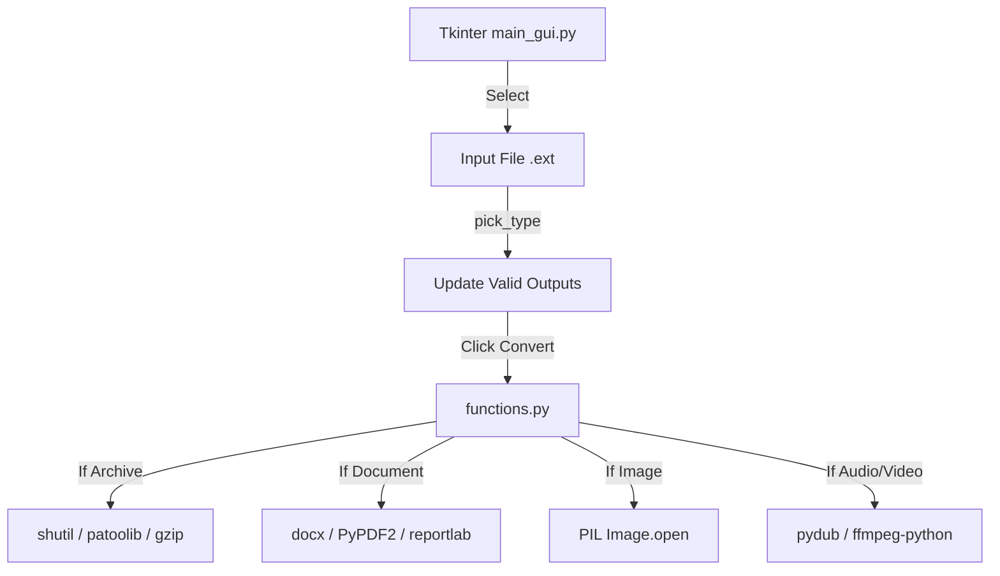

# Developer & Technical Documentation

This document provides a technical guide to the **FileConverter** application's architecture and execution.

---

## System Architecture

The application acts as a routing multiplexer. A Tkinter frontend analyzes file extensions and delegates operations to specialized library adapters in `functions.py`.



---

## Directory Structure & File Roles

```
.
├── main_gui.py         # Tkinter UI, Combobox routing logic, and dialog triggers
├── functions.py        # Vast library of conversion functions and exception handling
├── requirements.txt    # Pip dependencies list
├── README.md           # General overview
└── Documentation.md    # Technical documentation
```

---

## Workflow

The execution flow of FileConverter:
1. **Initialization**: `main_gui.py` boots `root = Tk()`.
2. **Action Trigger**: User selects a file. `pick_type()` splits the extension (`.rsplit('.', 1)[1]`), checks which of the 5 categorical arrays (documents, image, audio, video, archives) it belongs to, and populates the `ttk.Combobox`.
3. **Processing**: User clicks Convert. A massive `if/elif` block routes the data:
   - *Archives*: Maps to `shutil.unpack_archive` or `patoolib.extract_archive`.
   - *Docs*: Initializes `DocxDocument` objects, uses `PyPDF2.PdfReader` to extract pages, or uses `reportlab.canvas` to draw wrapped strings.
   - *Images*: Uses `PIL` to convert `RGBA` or `LA` color modes to pure `RGB` (via mask pasting) before saving to lossy formats like `.jpeg`.
   - *Media*: Pushes through `ffmpeg.input().output().run()` or `AudioSegment.from_file()`.

---

## Launcher Compilation Guide

Ensure all external binaries (`ffmpeg`) are installed on your OS level.

### Compilation or Execution Commands

Execute the following commands in order within your terminal:

```powershell
# Install pip dependencies
pip install -r requirements.txt

# Run the app
python main_gui.py
```
